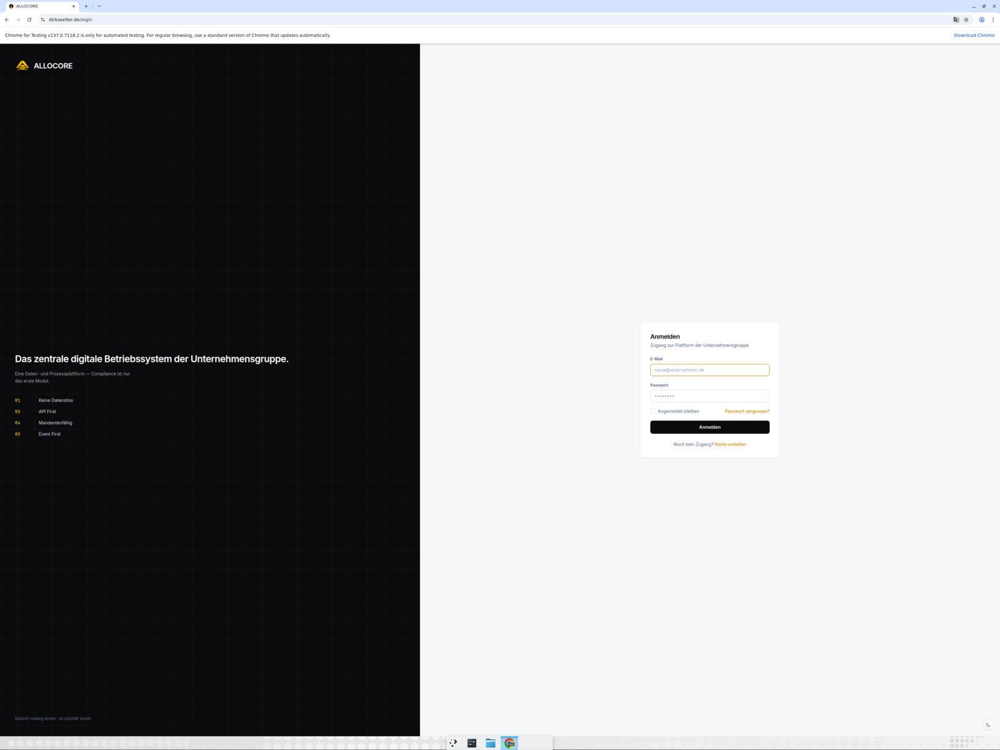
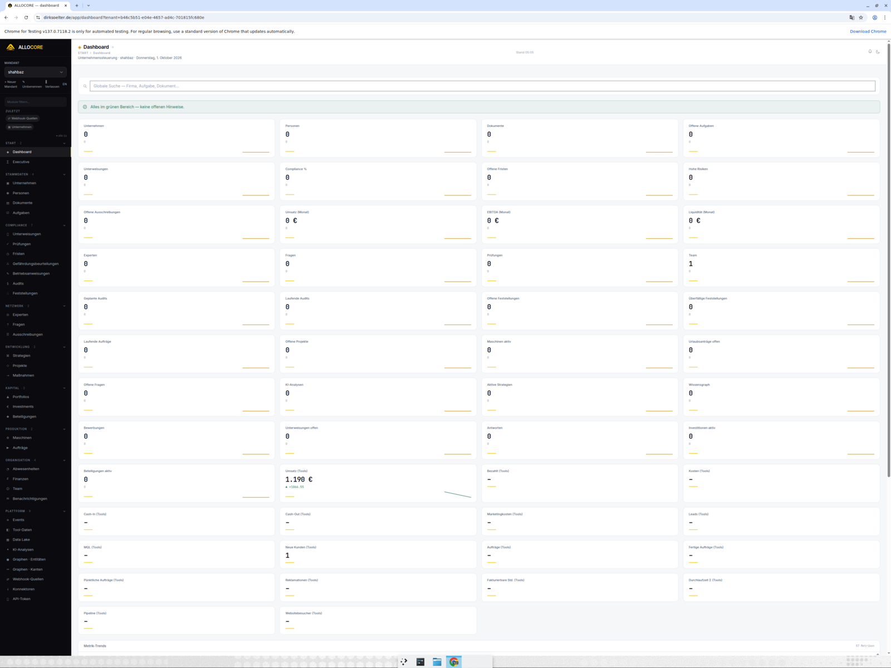
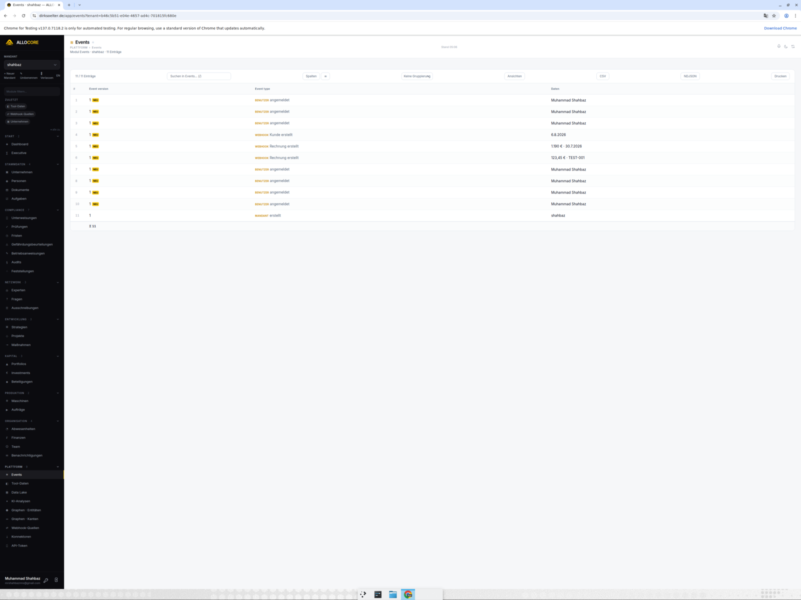
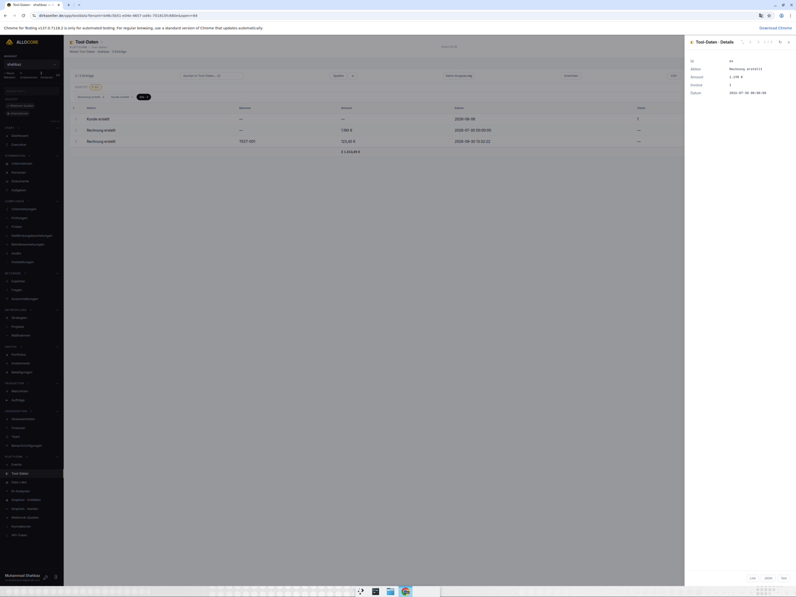
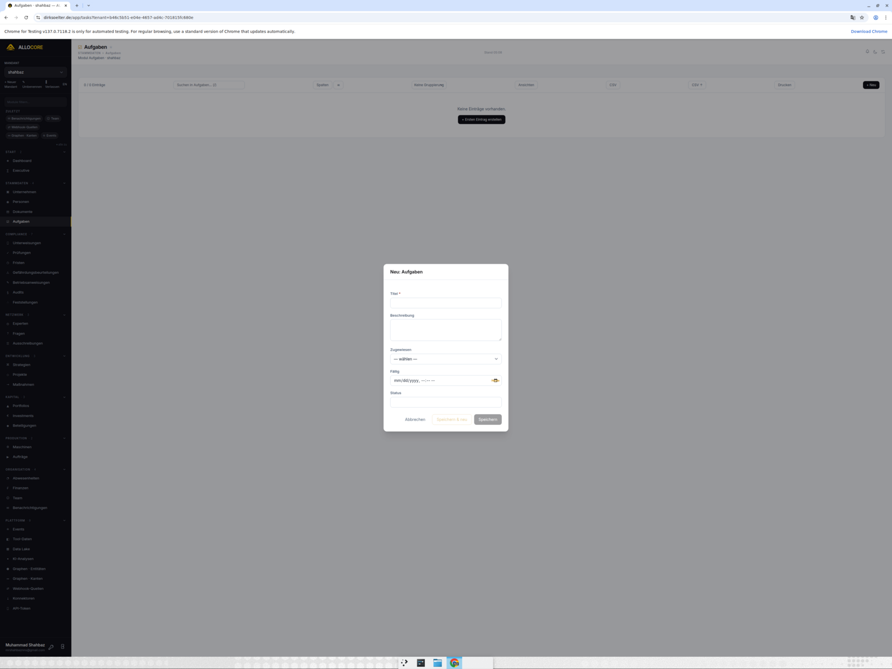
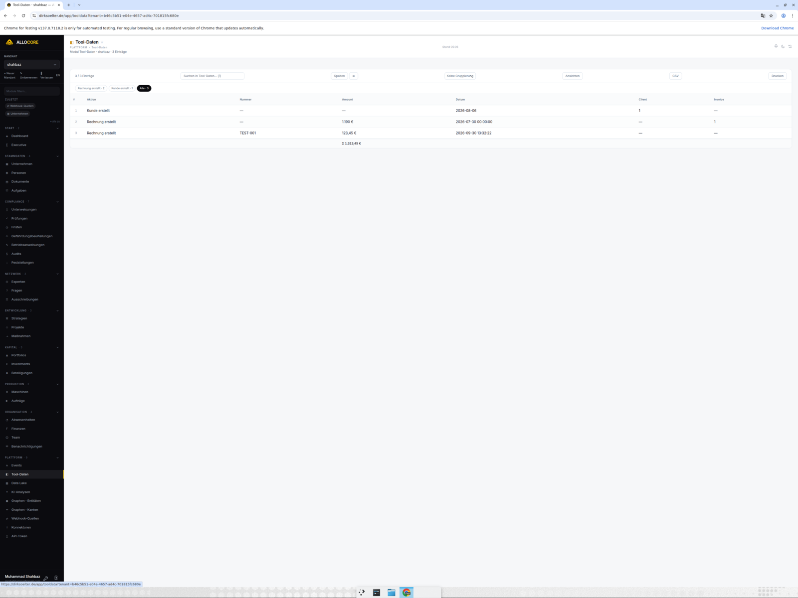
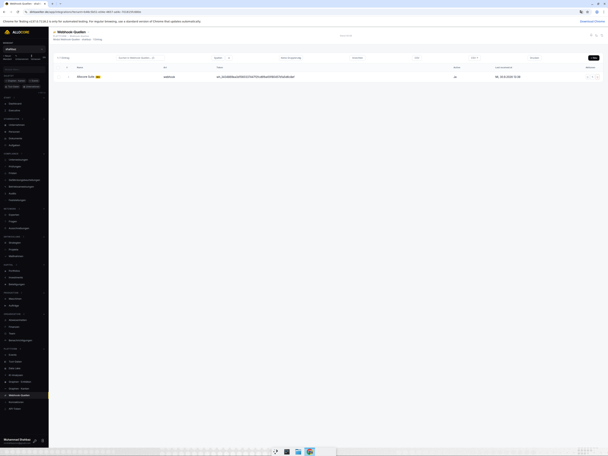
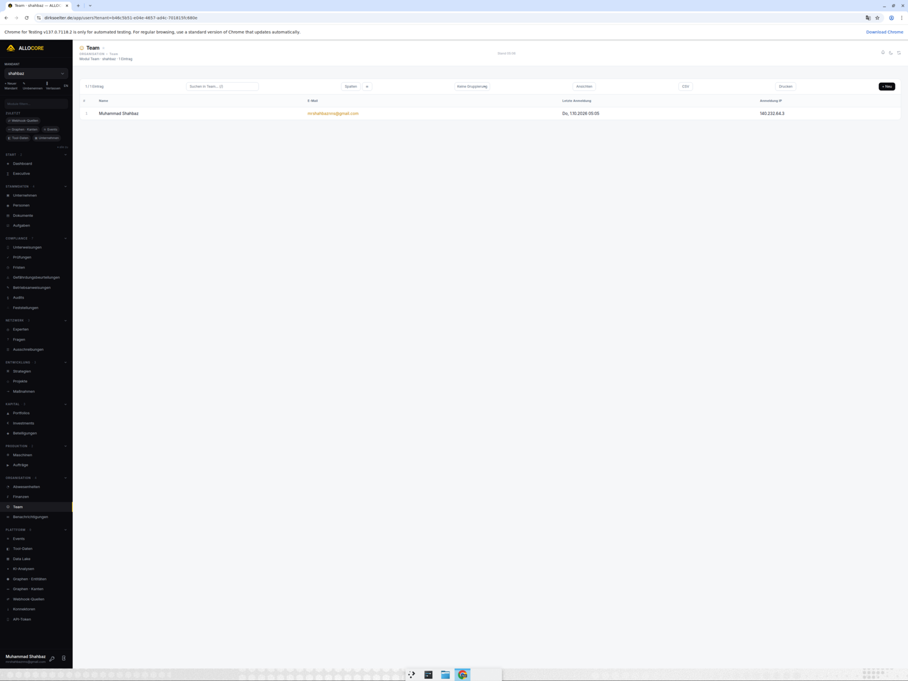
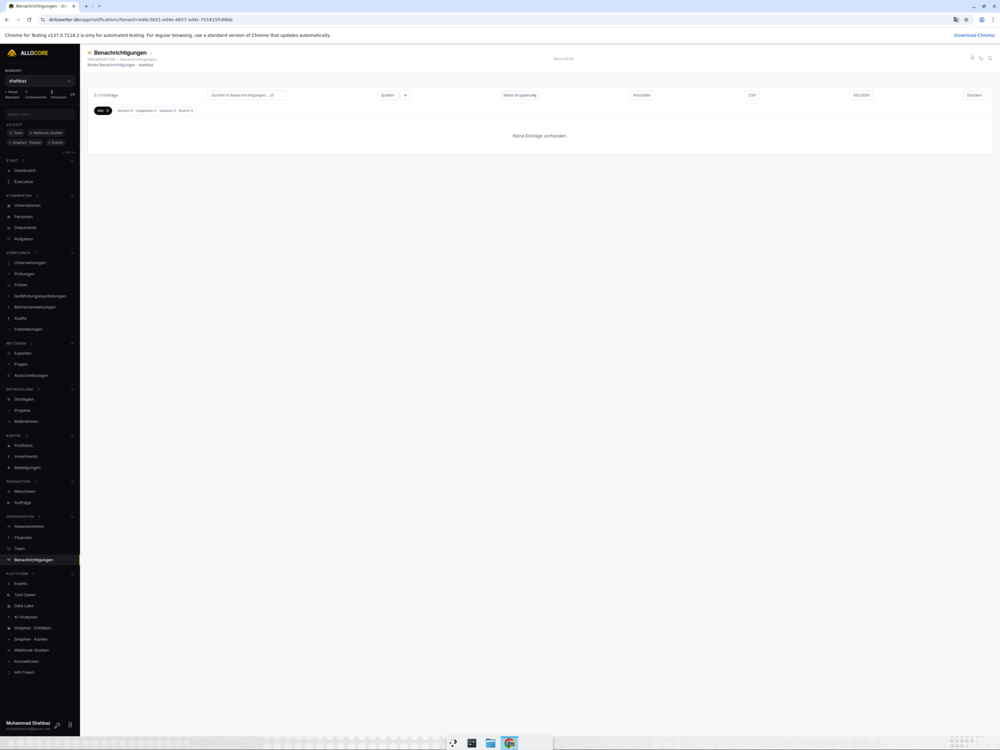
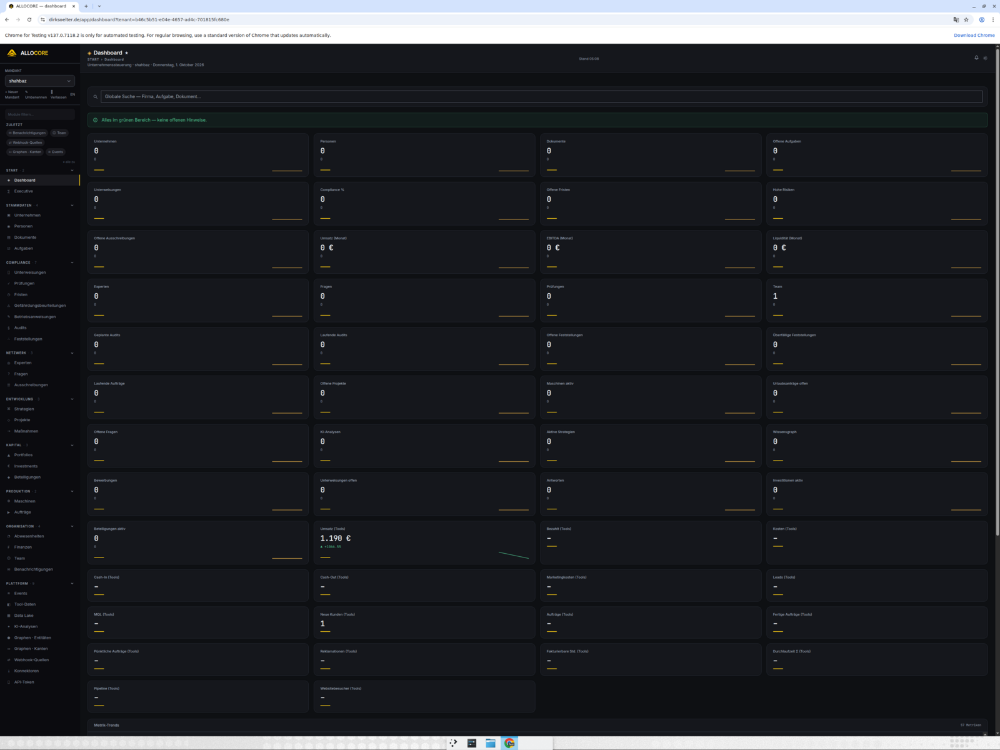

# ALLOCORE Manager — Benutzerhandbuch

Dieses Handbuch beschreibt die wichtigsten Funktionen des Managers anhand echter Screenshots aus dem Produktivsystem.

## 1. Anmeldung

Unter `https://dirksoelter.de/login` mit E-Mail und Passwort anmelden.

Nach dem Login landen Sie auf dem Dashboard. Der Mandant (die ausgewählte Firma) steht links oben — über den Selektor oder die Taste `y` wechseln Sie zwischen Ihren Mandanten.

## 2. Dashboard

Das Dashboard zeigt die KPI-Karten des aktiven Mandanten: interne Kennzahlen (Umsatz, EBITDA, Liquidität) und die **Tool-KPIs** (Karten mit „(Tools)"), die aus der Allocore Suite per Webhook gespeist werden — z. B. Umsatz, Kosten, Cash-In, Leads und Aufträge.

Weitere Widgets: Nächste Fristen, Offene Aufgaben, Überfällige Einträge, Aktivität (7/14/30 Tage), Insights. Ist nichts fällig, erscheint „Alles im grünen Bereich".

## 3. Sektionen & Listen

Alle Module liegen in der linken Sidebar (gruppiert: STAMMDATEN, DOKUMENTE, AUFGABEN, COMPLIANCE, PERSONAL, FINANZEN, PRODUKTION, EXPERTEN, UNTERNEHMEN, PLATTFORM, EXECUTIVE).

Listen bieten:

- **Suche** (`/`) — auch FK-Namen werden durchsucht
- **Sortierung** — Spaltenkopf anklicken (`?sort=` in der URL)
- **Filter-Chips** — Status, Überfällig, ≤7 Tage, Heute, Mir zugewiesen; alle Filter sind URL-teilbar
- **Ansichten** — gespeicherte Filter-Presets (Taste `v`)
- **Spalten** — Sichtbarkeit pro Sektion ein-/ausblenden (Taste `c`)
- **Aktionen** — CSV/JSON-Export, Drucken, CSV-Import, Bulk-Status/-Löschen mit Rückgängig

## 4. Detail-Drawer

Ein Klick auf eine Zeile öffnet den Detail-Drawer: alle Felder formatiert, VERLAUF (Ereignisse des Datensatzes), BENACHRICHTIGUNGEN, Status-Quick-Actions, Bearbeiten (`e`), Duplizieren (`d`), Löschen (Zwei-Klick-Bestätigung + Rückgängig), Deep-Link kopieren (`p`).

## 5. Neu anlegen

Über **+ Neu** (Taste `n`) öffnet sich das Formular — Pflichtfelder sind markiert, FK-Felder bieten filterbare Dropdowns, `Strg+Enter` speichert, „Speichern & neu" legt direkt den nächsten Eintrag an.

## 6. Tool-Daten

**PLATTFORM → Tool-Daten** zeigt die von der Suite eintreffenden Webhook-Daten als strukturierte Tabellen — je Event-Typ eigene Spalten (z. B. Rechnungsnr., Kunde, Betrag, Datum). Chips oben filtern pro Typ.

## 7. Integrationen

**PLATTFORM → Integrationen** verwaltet die Webhook-Quellen: pro Quelle ein geheimer Token in der URL `…/api/v1/webhooks/wh_…`, Status und „Zuletzt empfangen". Über „Neu" legen Sie pro Mandant eine eigene Quelle an.

Die Suite verbindet sich selbstständig: auf allocore.de unter „Connect to Allocore Manager" mit den Manager-Zugangsdaten autorisieren — der Token wird automatisch erzeugt und in der Suite gespeichert (kein .env nötig).

## 8. Team & Rollen

**Team** listet die Mitglieder des Mandanten mit Rollen, letzter Anmeldung und IP. Über den Drawer vergeben/entziehen Sie Rollen (nur bis zu Ihren eigenen Berechtigungen) und entfernen Mitglieder. Eigene Rollen mit Rechte-Matrix legen Sie unter Rollen an.

## 9. Benachrichtigungen

Die Glocke oben rechts zeigt ungelesene Benachrichtigungen (Badge) — Fristen, Erinnerungen, Hinweise, Zuweisungen. **Benachrichtigungen** ist zudem eine eigene Sektion mit Filtern (Art, Code, Ungelesen, Stumm) und Export.

## 10. Dark Mode & Sprache

Taste `t` schaltet den Dark Mode um; der Schalter EN/DE wechselt die komplette Oberfläche zwischen Deutsch und Englisch — beides bleibt pro Browser gespeichert.

## 11. Tastenkürzel (Auswahl)

| Taste | Aktion |
|-------|--------|
| `/` | Suche fokussieren |
| `n` | Neuer Eintrag |
| `e` / `d` | Bearbeiten / Duplizieren |
| `a` | Alle sichtbaren Zeilen auswählen |
| `g` | Gruppierung umschalten |
| `v` / `c` | Ansichten / Spalten |
| `u` / `s` / `b` | Überfällig / ≤7 Tage / Heute |
| `r` | Liste neu laden |
| `t` | Dark Mode |
| `y` | Mandant wechseln |
| `Strg+K` | Befehlspalette (Module + globale Suche) |
| `?` | Vollständige Tastenkürzel-Hilfe |
